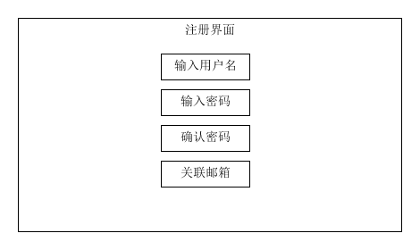
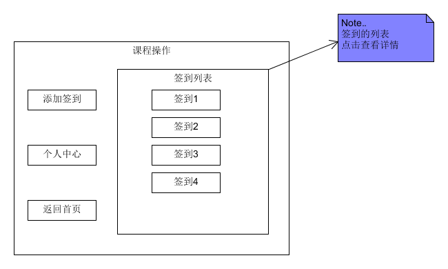
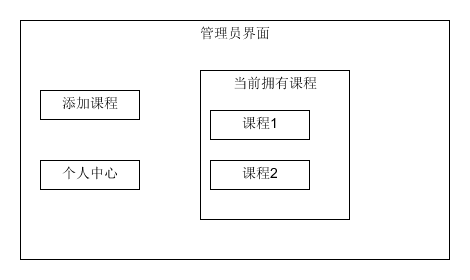
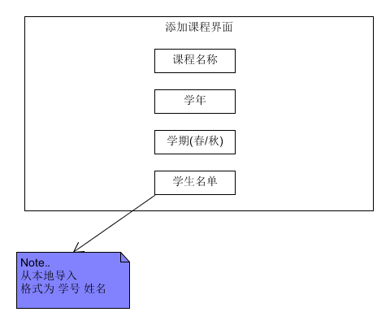

## 第8周工作汇报
本周与小组成员进行了实训计划的会议，初步确定了实训的安排表以及项目各个界面的初步设计。

本周的主要工作是确定项目中几个界面的设计，并使用nodejs建立服务器，完成登录注册，签到等几个基础页面的实现以及相应的逻辑功能的实现。

几个界面的设计如下：

登录注册界面

签到界面

注册界面

课程操作

管理员界面

添加课程

签到详情

服务器的测试阶段，界面如下：

